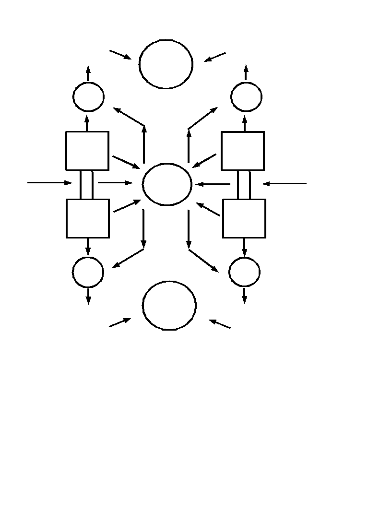

<strong>企画意図</strong>

<a href="files/world.pdf">「world.pdf」をダウンロード</a>

現在のTable-top Role Playing Game(以下TRPG)業界は冷え込んでいる。大きな問題は、本物と質の追求を行わなかったことにあります。宣伝を強化し続けた結果、肝心の本体の魅力が時代に合わなくなる程、弱体化してしまったのです。本質を失ってまで、せっかく強化した宣伝もコンピュータゲーム産業界を背景にした宣伝力に水を開けられてしまうという袋小路に入っています。 
何よりも大事なのは、遅れをとってしまった『TRPGシステムの質の向上』という、再検討、信頼性の追究と『ゲームの限界を超える』という、本物のTRPGを追求することです。 
この思想の元、概存のTRPGシステムの限界を突き崩す為に作られたのが、 
system　なのです。

 
<strong>system　の信念</strong>

<u>・ユーザーに確かな信頼性を実感させます。</u> 
サポートばかりではなく、システム的にです。これは、どの概存のTRPGシステムでも成しえなかった画期的なことです。これにより、抜群の快適性でゲームを行うことができます。  
<u>・ゲームという枠さえ越える、豊かな楽しみを提供します。</u> 
そこには、本来TRPGが持っていた先進性を垣間見ることができるでしょう。  
<u>・無限の拡張性を保証します。</u> 
これは、無限という名の"永遠のからっぽ"を意味しません。「ユーザーの自力に頼っていた」概存のTRPGシステムでは得られない真の自由度と信頼性のある創造力を驚く程、容易に手にできます。

 
<strong>確かな信頼性</strong>

どんなに優れた思想のシステムでも、あらゆるセッションで１００％力を発揮できなければ、システムがその場に存在しないのと同じです。 
systemでは基本部分をあえてシンプルなものとし、あらゆる状況で迅速かつ、正確なルール運用を可能としています。 
常にユーザーの意志に適確に答えてくれるシステム。これがsystemの信頼性なのです。

 
<strong>豊かな楽しみ</strong> 
　 
systemの優れている点は、ゲームである以上「楽しみを提供できる」という一点にあります。しかし、昨今のただ刹那的な快楽を追いつづけるゲームをsystemは目指しません。 
豊かであること。これがsystemの進む道なのです。 
概存のゲームでは得られない豊かな楽しみは、ユーザーに幸福感さえ感じさせるでしょう。

 
<strong>無限の拡張性</strong>

　ユーザーの多種多様な要求に答える為、systemはあらかじめ拡張性を考慮して作られています。 
　従来のシステムでは、ユーザーに多大な負担を与える欠点が通例でしたが、systemでは、その負担を取り除きました。これは、安易にお仕着せのインスタント・アイディアをユーザーに強いる偽りの簡単さではありません。 
　簡単さの大きな違いは、ユーザー個人の創造力を容易に形にすることができるよう、system化されている事実なのです。 
　拡張性がsystem化されている事実は、誰でも納得できるアイディアをどなたでも発想できる真実となって表れます。

 
<strong>妥協のない品質管理</strong>

　大量作成と品質管理は相反するものです。品質管理という基本的な部分を守る為、systemは具体的な方策として、品質本位を基本とします。 
　このことは利益追求の為、品質を落とすという本末転倒した過ちを犯さないという決意でもあります。 
　この思想に共感して頂けるsystemのユーザーは、比類なき高品質を永年体験し続けることが可能となるでしょう。

