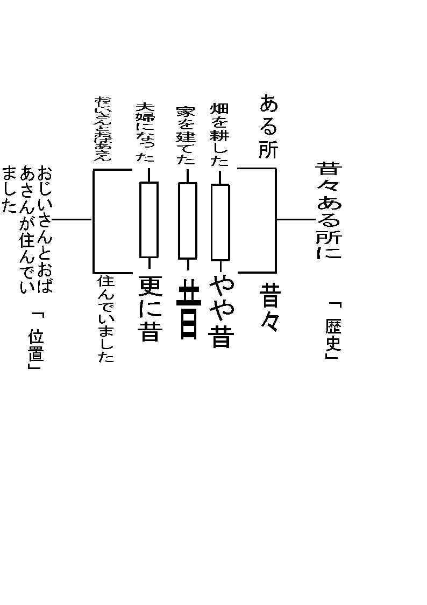

system 
話の作り方 
まずシステムにキーワードを入れて決めます。 
そしてシステム通り分割すると自然と 
話の構造化がなされます。

<a href="files/story.pdf">「story.pdf」をダウンロード</a> 
(例は”桃太郎”の冒頭部分から) 
分割の基準ですが、「一般的」か、「固有的」かという基準によって成り立ちます。 
<strong>上方が「固有的」、下辺が「一般的」</strong>ということになります。

 
固有と一般的はどのように分けたらよいのでしょう。 
区別はありません。恣意的です。しかしそれで良いのです。これがsystemの懐の深さです。

 
そして左右どちらか片方に「テーマ」を決めます。 
例では、「歴史」となります。

加えて左右の反対側に「テーマ」を展開するにあたり「テーマを固定するもの」を決めます。 
例では「位置」となります。

 
自由に決めた上辺下辺からテーマと固定するものから 
さらに話しを作ることが可能です。

 
その話しがどのような背景で成り立ったのか。こういう疑問に答えてくれます。 
そう世界は、つながっているのです。

どんどん分割し、パーティーにあったレベルの話をあてがう事も可能です。 
もちろん少し背伸びをして難しいクエストをパーティーが選択出来るようにしても良いでしょう。

簡単な話が実は大きな話に繋がっている。考えただけでうれしいではないですか。 
Gmもシナリオ不足に陥ることもなくなります。

どのように進めたらよいでしょう。

