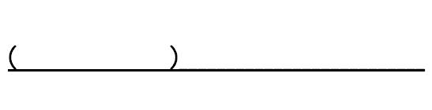
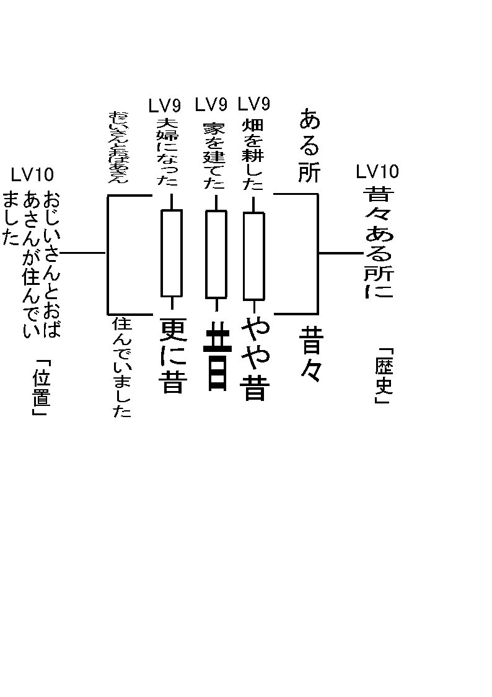

<strong>イベント表</strong> 

<a href="files/event.pdf">「event.pdf」をダウンロード</a>

それは分解した話をシートに書いていくだけです。<strong>括弧内が一般的、下線内が固有的</strong>です。 
これを分解し、それぞれのプレイヤーに配り概要をつかんでもらいます。

 
またはイベント毎に配ってもかまいません。

これは採用するシステムによります。よりドラマ指向なら前もって配る率が高くなります。 
よりアクション指向ならセクション毎に配ります。（この場合、当然複雑な物は瞬時にアクションが起こせないので駄目です）

<a href="files/story-ex.pdf">「story-ex.pdf」をダウンロード</a> 
また、物語は通常、分解するたび高いレベルから低いレベルへと変わります。

