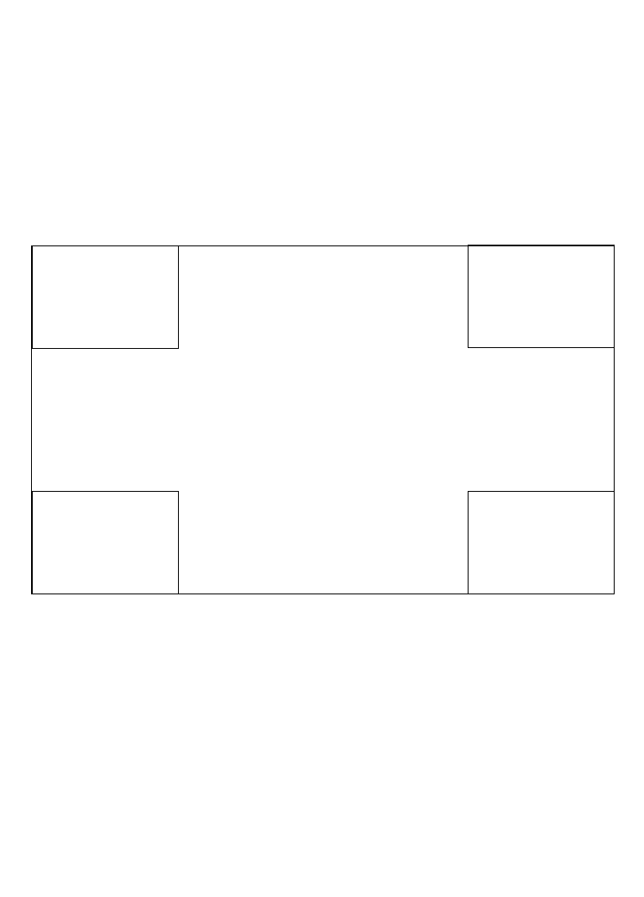
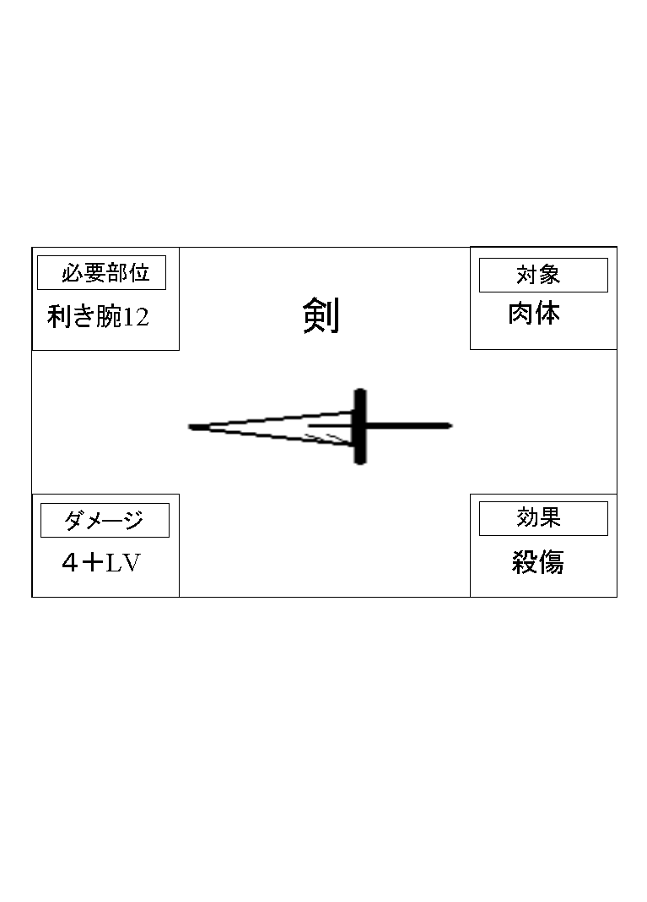

<h3>第三章　アクションカード</h3>

それぞれ、世界観に合わせてアクションカードを作成します。相手の出した目を越えた分だけ、 
効果を与えます 
場カードの影響を受けます。

 
 
<a href="files/action.pdf">「action.pdf」をダウンロード</a>

（例として剣、魔法の世界） 
 
<a href="files/action-example-sword.pdf">「action-example-sword.pdf」をダウンロード</a>

剣、魔法の世界での剣では、このようになります。

