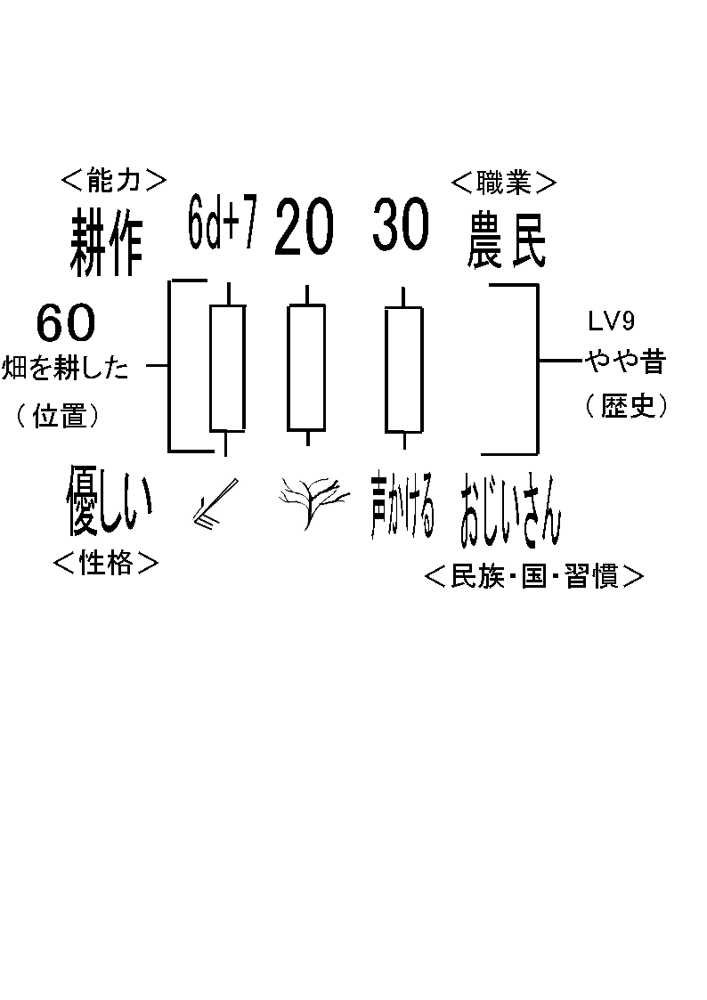
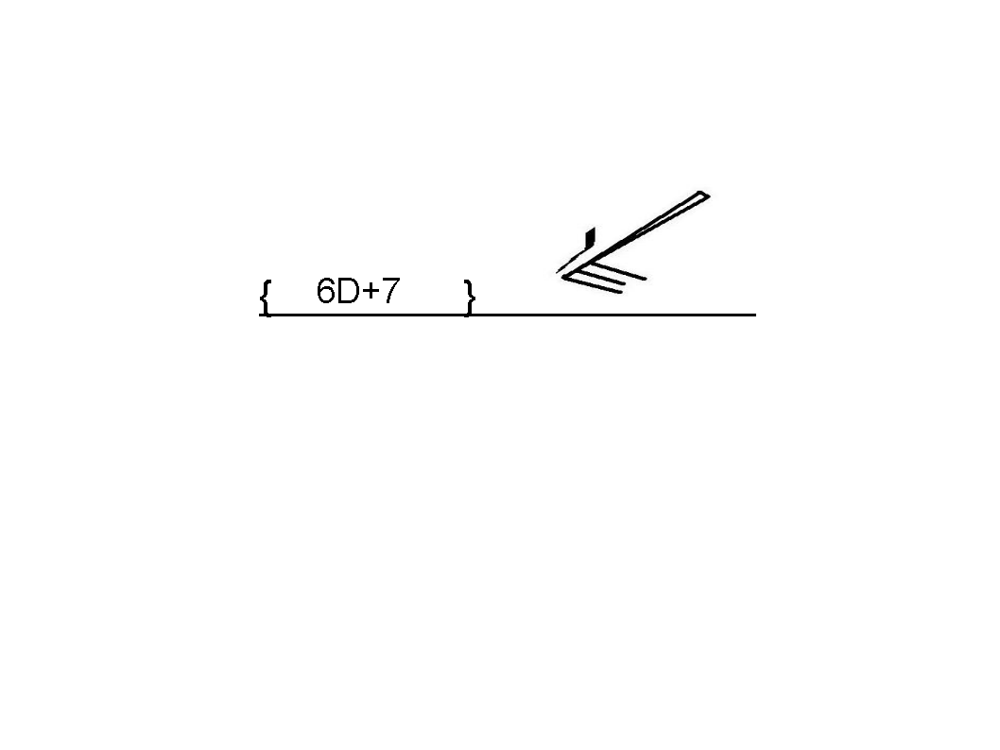

キャラクタ性格の作り方<strong>＜描写シート＞</strong>

まずシステムにキーワードを入れて決めます。 
そしてシステム通り分割すると自然に 
キャラクタ性格の構造化がなされます。

<a href="files/character-story.pdf">「character-story.pdf」をダウンロード</a>

(例は”桃太郎”のおじいさん　おばあさんから) 
分割の基準ですが、「一般的」か、「固有的」かという基準によって成り立ちます。 
<strong>上方が「一般的」、下辺が「固有的」</strong>ということになります。

固有と一般的はどのように分けたらよいのでしょう。 
区別はありません。恣意的です。しかしそれで良いのです。これがsystemの懐の深さです。 
（デザイナーがかっちりした世界を構築しているなら恣意的に決めてもよいですし 
決めていない自由な世界観ならデザイナー＞GM＞プレイヤーと段階的に権限委譲できます  
分野ごとにもシステム的に分けることが出来ます）

そして左右どちらか片方に「テーマ」を決めます。  
例では、<strong>「農民のおじいさん」</strong>とします（プレイヤーが噛みしめるテーマです　農民のおじいさんをシミュレートするつもりなのかも）。  
（キャラクタと話が密接に結びついているシステムなら、「テーマを固定するもの」と同じが良いでしょう：世界観もキャラクターも歩み寄っているもの  
　キャラクタの個性を前面に打ち出した　キャラクタ間の横のつながりが強いシステムの場合 
「テーマを固定するもの」である数は少なくなります：キャラクター同士から話が発生し世界観さえ構築するもの

キャラクターと世界観のテーマが大きく離れており、キャラクターからも世界観を構築しないものは、話に参加できません、GMが無理に組み合わせればそれはギャク的世界観の再現となるでしょう）

<strong>＊キャラクター側からは、ちょうど話の分解とは逆の「テーマを固定するもの」からの動きが基本となります。</strong>

加えて左右の反対側に「テーマ」を展開するにあたり「テーマを固定するもの（職業・スキル）」を決めます。  
例では<strong>「優しく耕作している」</strong>となります。

<strong>＊つまりキャラクター側からは”農民のおじいさんが優しく耕作している”という隠れたテーマを入れていることになります（今回はキャラクターが強い世界観なのでこうなります　いきなり基本外しです）。</strong>

自由に決めた上辺下辺からテーマと固定するものから 
さらにキャラクタ性格を作ることが可能です。

そのキャラクタがどのような背景で成り立ったのか。こういう疑問に答えてくれます。 
そうキャラクタと世界は、つながっているのです。

どんどん分割し、場面（場カード）に合ったレベルに合わし再現する可能性を上げることも可能です。軽い仕草などあてがうのです。 
もちろん少し背伸びをして上位のキャラクタ描写をしても良いでしょう。

簡単な行動が実はキャラクタ描写、話に繋がっている。考えただけでうれしいではないですか。 
プレイヤーもキャラクタ描写に困ることもなくなります。

どのように進めたらよいでしょう。

<a href="files/character-event.pdf">「character-event.pdf」をダウンロード</a>

<a href="files/character-event-ex.pdf">「character-event-ex.pdf」をダウンロード</a>

それは分解した描写をシートに書いていくだけです。<strong>括弧内が一般的、下線内が固有的</strong>です。 
これを分解し、GMに配り概要をつかんでもらいます。

またはイベント毎に配ってもかまいません。

これは採用するシステムによります。よりドラマ指向なら前もって配る率が高くなります。 
よりアクション指向ならセクション毎に配ります。（この場合、当然複雑な物は瞬時にアクションが起こせないので駄目です） 

