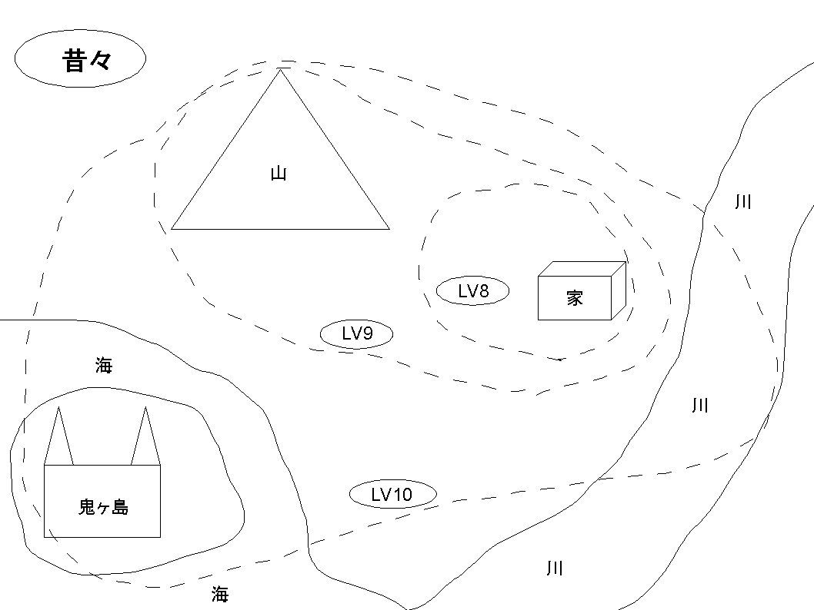
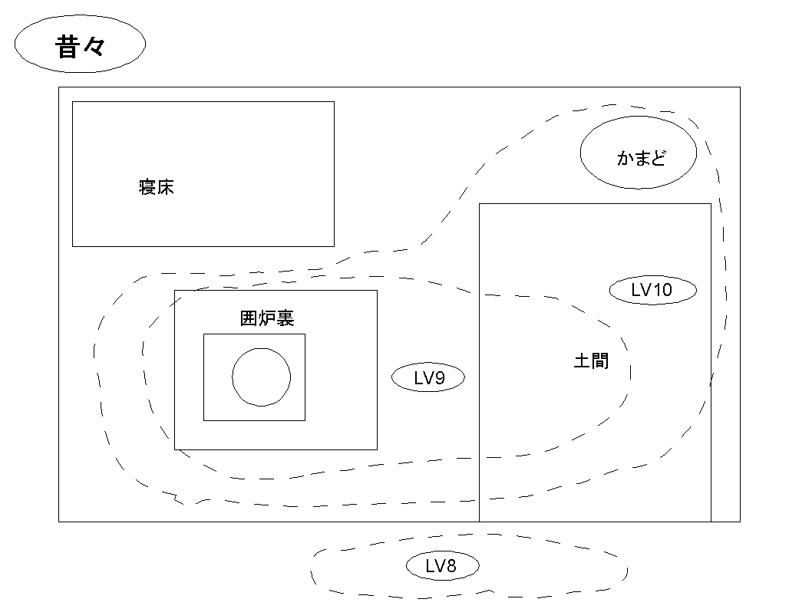
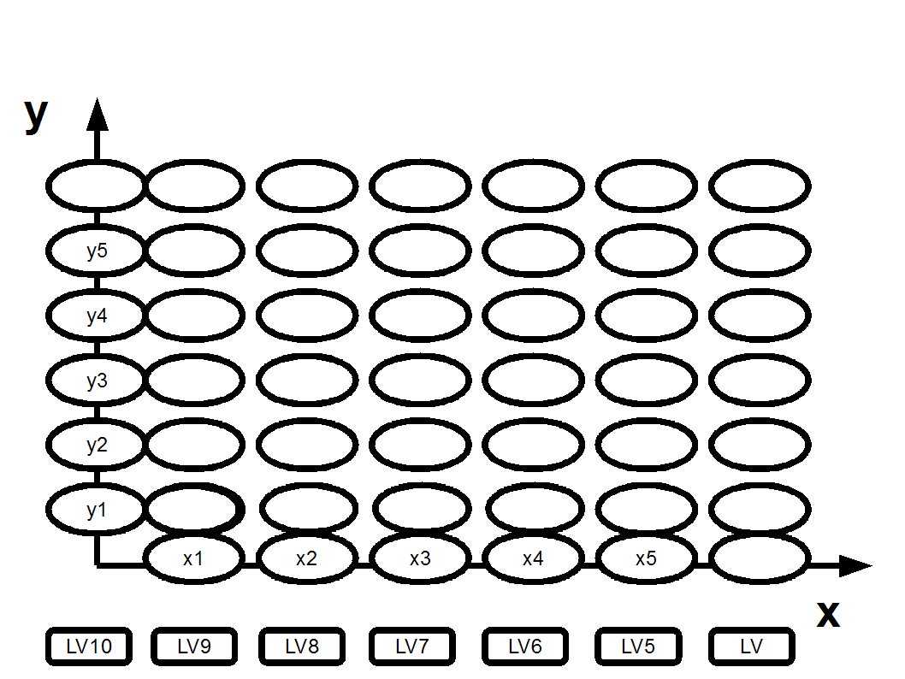
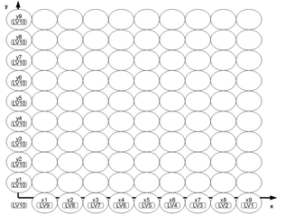

ワールドガイド

systemのワールドガイドはこのようになります。

ワールドガイドの地図には模式図と 
レベル（LV）が記載してあります。 
これは、話のレベルということです。

重要なのは「場所」「時期」「話の区切り」「位置」です。

<a href="http://kinniro.tea-nifty.com/system/files/worldguide.pdf">「worldguide.pdf」をダウンロード</a>

「場所」は鬼ヶ島が出現する前です。 
「時期」は「やや昔」です。 
「話の区切り」は川まで広がっています。 
「位置」は話のLVが低ければ「家の周辺」、少し上がれば「山」まで。それ以上だと「川」までです。 
それ以外では、このワールドガイドでは話は存在しない。 
こういうことで話のブレも規制できます。

<a href="files/worldguide2.pdf">「worldguide2.pdf」をダウンロード</a>

「場所」は鬼ヶ島が出現した頃です。 
「時期」は「昔々」です。 
「話の区切り」は鬼ヶ島まで広がっています。 
「位置」は話のLVが低ければ「家の周辺」、少し上がれば「山と川周辺」。それ以上だと「鬼ヶ島」までです。 
それ以外では、このワールドガイドでは話は存在しない。 
こういうことで話のブレも規制できます。

カッコ付ですがこのような時間の遷移も表現可能です。 
年表があるような厳密な世界も、表現可能です。

<a href="files/worldguide3.pdf">「worldguide3.pdf」をダウンロード</a>

ワールドガイドは壮大な地図にとどまりません。 
このような家、限定された場所も可能なのです！

「場所」は鬼ヶ島が出現した頃です。 
「時期」は「昔々」です。 
「話の区切り」は家周辺です。 
「位置」は話のLVが低ければ「家の周り」、少し上がれば「囲炉裏と土間」。それ以上だと「かまど」までです。 
それ以外では、このワールドガイドでは話は存在しない。 
こういうことで話のブレも規制できます。

 
これを進め、緊張の茶室、壮麗な宮廷、精神で階層化されたSF仮想サイバー世界、珍妙な社会制度、職業の思想世界（職業によって見える世界が違う！）など 
細かく決められ、表現できる事に気づくでしょう。

 
従来のシステムでは出来なかった世界を表せるのです！ 
また重要なのは管理が簡単でプレイして楽しいことです。 
systemでは実現する可能性が高いはずです。

 
もちろん従来のシステムでも面白みを上げられます。 
GMやプレイヤー技量が必要だったり、管理が大変なシティシナリオや陰謀うごめく世界を簡単に作成表現可能です。（<a href="0200_SEANE_CARD.md">二章の場カード</a>と合わせれば、例えばファンタジー世界で今まで足手まといだった貴族が街に入れば戦士と代わり、とても役に立つなど表現可能　）

非常な戦闘力を持った彼、彼女だけでなく 
ほんの小さな彼、彼女の言葉言動が、同じくらい世界を突き動かすことが可能なのです。 
（一滴の涙や署名さえも）

きっとワクワクする豊かな世界を垣間見れるはずです。

 
<strong>＜遷移の分類＞</strong>

・同じ物語レベルの話でもカッコ付で遷移（時間など）を作りたい場合もあるでしょう。

その場合、「y1：やや昔」などと書きます。

・話を構造化して低い物語レベルを作る場合、カッコ付で遷移を作りたい場合もあるでしょう。

その場合、「x1：やや昔」などと書きます。

　

 
<a href="files/worldguidextoy.pdf">「worldguidextoy.pdf」をダウンロード</a>

 
　上記のようにsystemは世界観や判定の遷移を容易に視覚化、整理できます。 
このことにより実際に使いやすいワールドガイドを構築出来ます。その場その場でまるで生き物のように 
組みあがっていくはずです。　

　今までのシステムでは見逃してきた点をsystemは大いにサポートしています！ 
熟練者でも困ってきたことが氷解するはずです。

　

<a href="files/worldguide-xtoy2.pdf">「worldguide-xtoy.pdf」をダウンロード</a>

LV1まで分解する世界観はこのように書くとよいでしょう（世界観が強い世界）。

