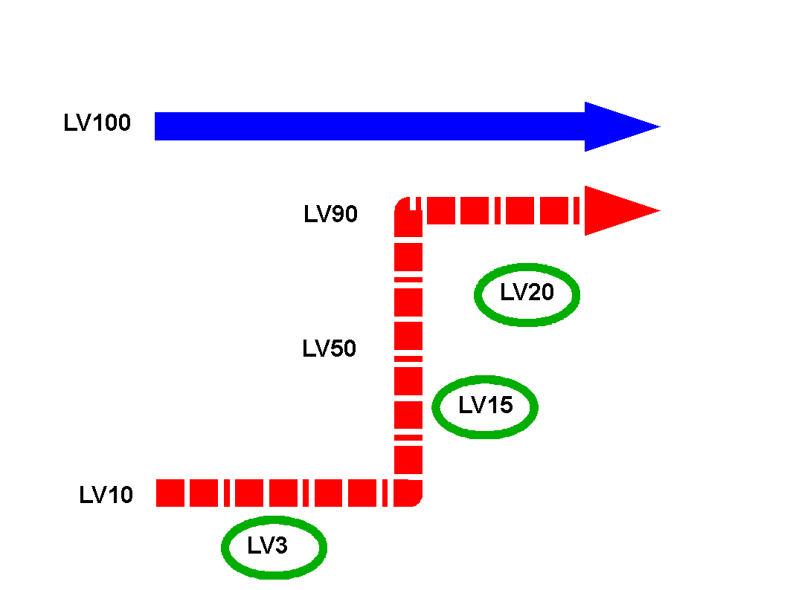

行為判定、成長

　systemは物語レベルでキャラクターのレベルが上がりすぎることによる崩壊を未然に防げます。 
非常に論理的です。

　今までのシステムではこの点が、あやふやだったのではないでしょうか？

　一番上の物語レベルが最高です。一番上がLV100であればこれ以上のレベルは存在しえません。

<a href="files/act-growth.pdf">「act-growth.pdf」をダウンロード</a>

　レベルアップとは上位の物語に関われる物語レベルが上がるという事です。

　つまり、技能、力的に弱い人物が物語で重要な地位を占めている場合などあるでしょう。 
今までのシステムでは直接登場しなかったりあってもNPC止まりがでしたが、それをプレイヤーキャラクターとして表現、存在可能なのです！（緑の輪内がキャラクターの技能、力レベル　赤い破線がキャラクターの物語レベル推移となります）

<a href="files/act-growth2.pdf">「act-growth2.pdf」をダウンロード</a>

　また、技能レベルが物語レベルと折り合わない場合起こるトラブル。 
（ストーリー上重要な人物がプレイヤーから簡単に殺されてしまう） 
それによるセッションの崩壊もシステム的に防げます。

また、それは従来のヒーローポイントとは異なるのは明らですし 
重要キャラクターに垣根を作るようなものとは異なることは論理的に分かるようになっています。 
（キャラクター、パーティーの物語レベルを上げれば関われることが明示されている！）

　豊かで自然なのです。 
刹那的快楽を得るためになりがちなセッションを引き締めます。

　加えて、個々のキャラクターの物語レベルを足すことにより基本的に物語レベルでは有利になるようsystemは設計されております。　このことは、物語ゲーム的にパーティーが結成される意味となって現れます。 
　 
　これは意味があるソロプレイを推奨も出来るということでもあります。従来のシステムではパーティー結成が半ば強引に行われておりましたがsystemはこれを打破しています。

　従来のシステムではキャラクター背景で合流したくない状況、性格は否定され、それが好きなプレイヤーは意味があるのに冷遇されていました。systemでは、これを無理なくゲーム的に実現、優遇出来ます。 
　極端な例ではキャンペーンを行い最後のみキャラクターが合流するセッションも出来るわけです。この場合でも、最後まで各セッションは物語で繋がっており、迅速にプレイできます。

今までのシステムでは成し得なかったことです！

