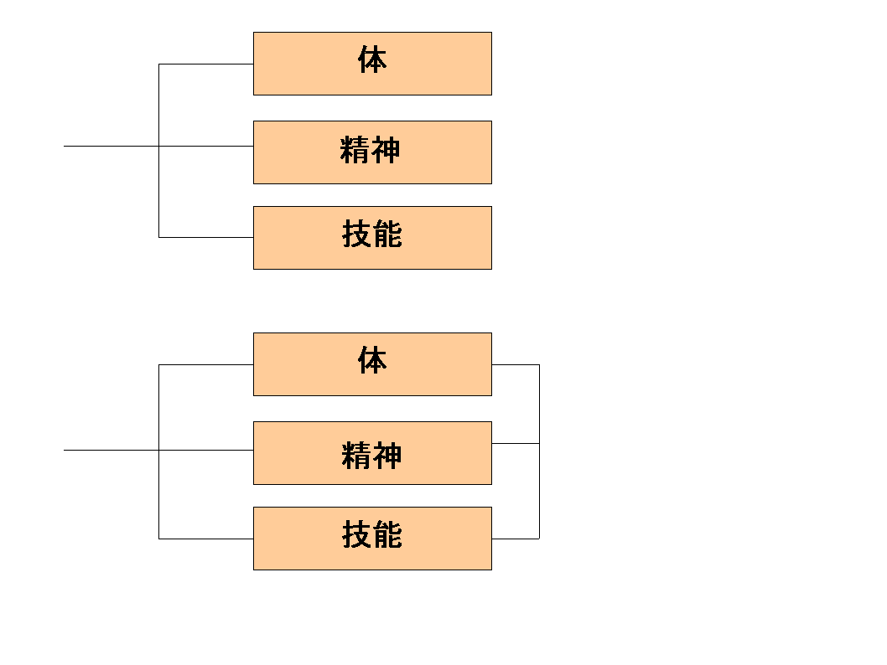

<strong>＜カテゴリ分け＞</strong>

各カテゴリは、それぞれ分離しているのも良いでしょうし 
連動しており、あるカテゴリが消えれば別のカテゴリが動かなくなる形も有用でしょう。

・「体」のカテゴリが重要であれば、「体」のカテゴリに影響があれば 
個々の「精神」「技能」等も影響がある世界観（従来形システムはこれがほとんど）

・「体」のカテゴリが重要でなければ、「体」のカテゴリに影響があっても個々の「精神」「技能」等に影響がない世界観（物語としてはあったが従来型システムとしては　うまく実現不能だった）<em><strong>例えば、キャラクターがすでに死んでいるホラーの世界や精神世界にいる住人などもプレイヤーキャラクターとして破綻なく再現可能なのです。</strong></em>

も実現可能なのです。 
　 

<a href="files/act-growth3.pdf">「act-growth3.pdf」をダウンロード</a>

<strong>体などのカテゴリ数値の目安</strong>  LVと同じ　LV10=1000なら1000  LVの半分　 
LV10=1000なら500  LVの4分の一　
LV10=1000
なら250

LVと比べカテゴリ数値が小さいとスリルがある世界が待っています。

同量なら普通です。注意点は各カテゴリを合計した総量はLVより数値は多くならないようにして下さい。

