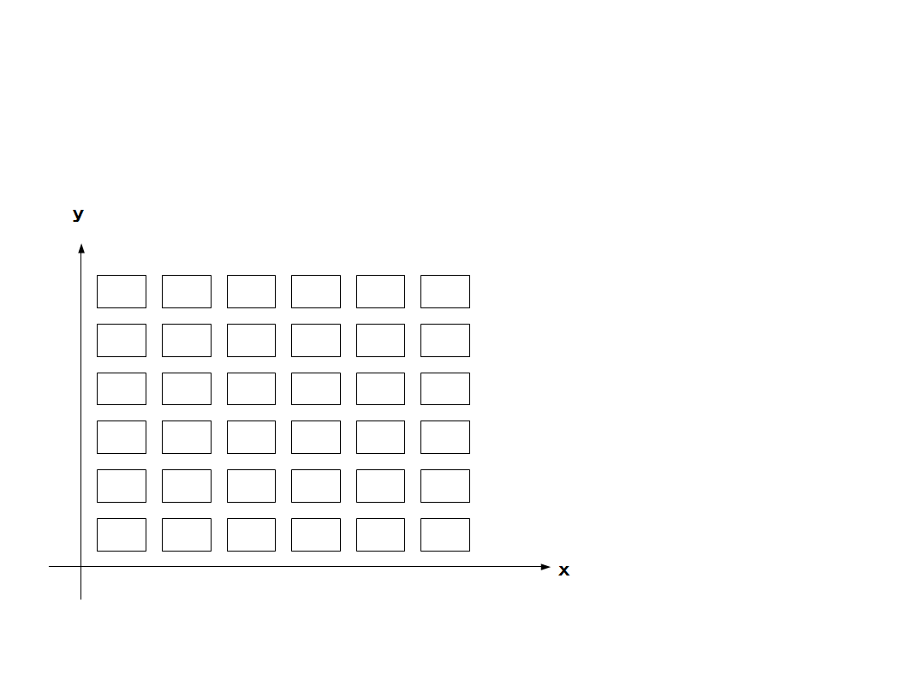

<strong>＜判定システムの選択、作成＞</strong>

判定システムの選択、作成をします。

これは、今までユーザーが自作してきたシステムを自由に組み込むか

systemが用意した型に沿って組み込みます。

<a href="files/s12345.pdf">「s12345.pdf」をダウンロード</a>

systemのレベルを活用することで安定動作、移植も比較的容易です。

以下の物を物語、場面に合わせて事前にデザイナーは選定します。

