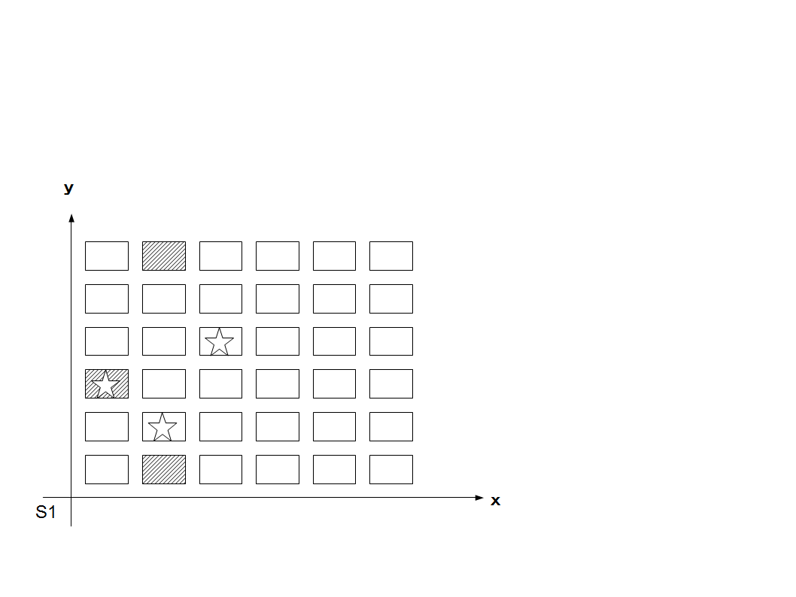

<strong>・馴染みのある基本的な物</strong> システム1 <strong>S1</strong>   1D6=x 1D6=y を数える  障害も同様。

<a href="files/S1.pdf">「S1.pdf」をダウンロード</a>

例： 障害で３つ指定、(x,y)=(1,3)(2,1)(2,6) をプレイヤーのサイコロで当てれば命中（(x,y)=(2,2)(3,4)(1,3)で1回命中で成功） 単純に超えれば命中、下回れば命中など。

