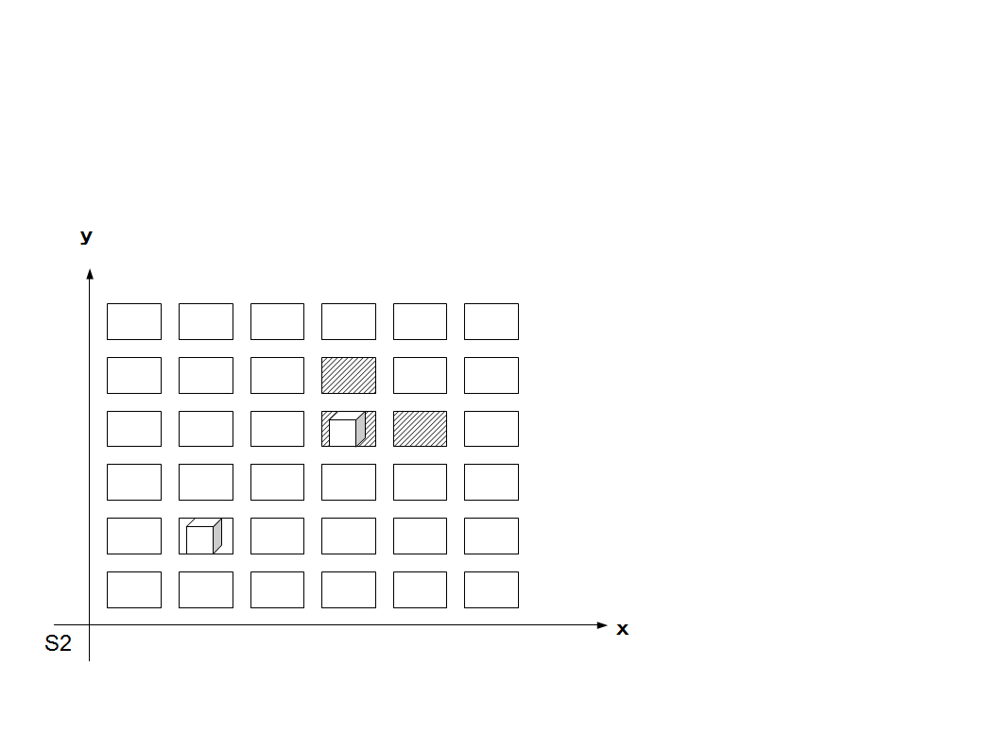

<strong>・安定したかっちりしたもの</strong> システム2 <strong>S2</strong>

ターン制

一人ずつサイコロを配置するか置かないか決められる（最初の順番は一人ずつ左にずれる）。

特定の場所に置けば効果発動（この場所はGMも含めたプレイヤーの数より少ない）。

特殊効果は1ターンごとポイント消費する（2つなら倍）。
   表をGMも含め共有する

配置している間は、そのサイコロは使えない。&nbsp; 

つまり、１つ配置ではxかyどちらかとなる。 
1D6=x 1D6=y

2つ配置ではサイコロを振れない。

サイコロを置かないことも選択可能。

x,yと関係ないサイコロを振ることで特殊効果を使うポイントを貯められる（これは共有しない）。

障害を超えるか、プレイヤーが敗北したら終了。

<a href="files/S2.pdf">「S2.pdf」をダウンロード</a>

例：ボードゲーム風に ４の４に配置している人は絶えず効果がある。２の２は効果なし（意味なし）。防御がxで攻撃がyとなる。サイコロ配置位置が特殊効果枠内ならポイントを消費して特殊効果発動する。

<em>不思議な魔法能力をパーティで共有している世界観なども面白い。</em>

