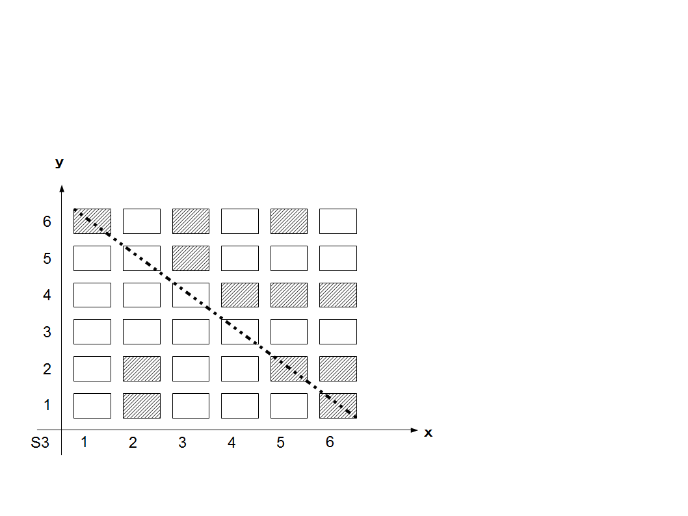

<strong>・バランスが悪いが味があるもの</strong> システム3 <strong>S3</strong>

1D6=x 1D6=y を文章や絵で語る

<a href="files/S3.pdf">「S3.pdf」をダウンロード</a>

プレイヤーの数に応じて6つ台詞、行動を決める。

■が能動的台詞、行動

□が受動的台詞、行動

y軸がプレイヤー、x軸がストーリー展開、斜め線が障害と言う事になります。

<strong>話の濃度の決定</strong>：能動と受動がワンセットで初めてプレイヤー側はポイントが得られます。それ以外は全て伏線となり障害（GM）側のポイントとなります。

世界観や話に合わせて濃度調整が出来ます。

濃度が高ければ伏線が多い話となります。濃度が低ければ裏表のない話となります。これは嗜好の問題であり濃度に優劣はありません。

サイコロ、プレイヤーの順番はGMから時計回りとなります。

濃度1：全て任意で決定

濃度2：一か所のみ１D6を振り決めます。ｘ：偶数□、奇数■　ｙ：偶数：偶数プレイヤー、奇数：奇数プレイヤー空いているところ

濃度3：二か所１D6を振り決めます。ｘ：偶数□、奇数■　ｙ：偶数：偶数プレイヤー、奇数：奇数プレイヤー空いているところ
 

濃度4：三か所１D6を振り決めます。ｘ：偶数□、奇数■　ｙ：偶数：偶数プレイヤー、奇数：奇数プレイヤー空いているところ
 

濃度5：四か所１D6を振り決めます。ｘ：偶数□、奇数■　ｙ：偶数：偶数プレイヤー、奇数：奇数プレイヤー空いているところ
 

濃度6：五か所１D6を振り決めます。ｘ：偶数□、奇数■　ｙ：偶数：偶数プレイヤー、奇数：奇数プレイヤー空いているところ
 

濃度7：六か所全て１D6を振り決めます。ｘ：偶数□、奇数■　ｙ：偶数：偶数プレイヤー、奇数：奇数プレイヤー空いているところ
 

<em>例では、濃度7でありx,y全て1D6で決めています。</em>

プレイヤー6：■ □ ■
□ ■ □ 

プレイヤー5：□ □ ■ □ □ □&nbsp; 

プレイヤー4：□ □ □
■ ■ ■&nbsp; 

プレイヤー3：□ □ □
□ □ □&nbsp; 

プレイヤー2：□ ■ □
□ ■ ■&nbsp; 

プレイヤー1：□ ■ □
□ □ ■ 
&nbsp; 

<strong>障害側の能動、受動の決定</strong>

出来あがった物から斜めに取り変換します。

障害： 
■ □ □ □ ■ ■から反対に変換して 

□ ■ ■ ■ □ □となります。 
 

■と□であらかじめ何をするか、行動と台詞を絵などで提示しておきます。

これが決定した後、プレイを始めます。

判定者はGMから時計回りに持ち回りで1シーンごと回していきます。能動的、受動的の対が出来たらプレイヤー側のポイントです。対が出来ないものは伏線となり障害側のポイントとなります（心の中で思った、NPCが代わりに言うなどで消化していきます）。

全部、消化したところで障害を越えたか判定します。

