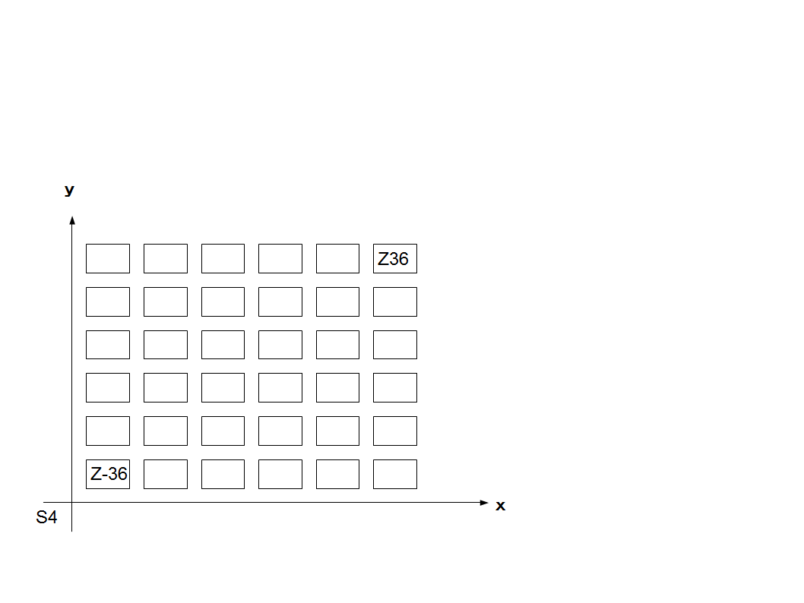

<strong>・壊れたもの</strong> システム4 <strong>S4</strong>  1D6=x 1D6=ｙ でｘ、ｙ軸から離れていく

<a href="files/S4.pdf">「S4.pdf」をダウンロード</a>

 
例：x,y=(6,6)ならx,y軸の位が一つ上がり、一マス３６と数え、再度サイコロを振る。再度、x,y=(6,6)なら2倍の７２となりx,y=(6,6)なら永遠と繰り返す（z軸拡張）。 x,y=(1,1)ならマイナス軸に移動して(-1,-1)から再度サイコロを振る（その場合全てマイナスとなるｘ,ｙ=(2,3)なら（-2,-3） ）等（マイナス軸拡張）。マイナス側もマイナスZ側拡張を行って-36,-72と繰り返してもよい。

<em>当たると大きいがマイナス面も大きい兵器や力などを表すのに良いと思われる。</em>

