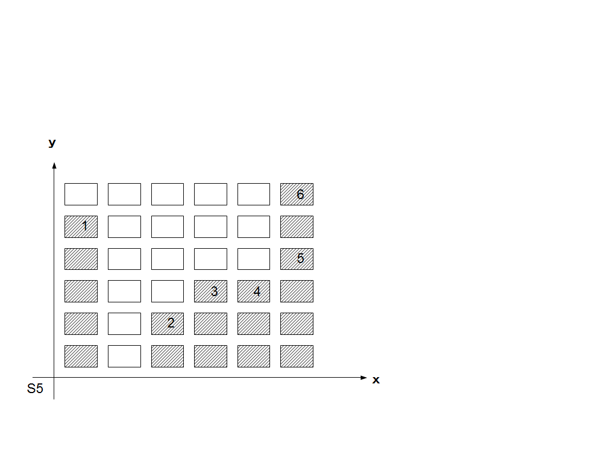

<strong>・system独自のもの</strong> システム5 <strong>S5</strong>

x,yでグラフで書く サイコロを振り面積を計算する。

<a href="files/S5.pdf">「S5.pdf」をダウンロード</a>

 
例：あらかじめ、それぞれのマスに １，２，３，４，５，６をグラフとなるように数値を入れます（連続でも非連続でもよい）。 そして１D6サイコロを振り 該当の面積をｘ、ｙ（横×縦）で 数えていきます。

<em>細かいグラフを自分で作成したい人向き。変わった動きも再現したい場合などに良い。</em>

