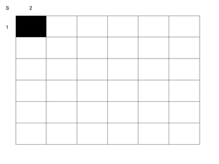

<strong>＜判定の調整と判定区域の明確化＞</strong> 

　作った判定や導入した、採用した判定の調整も容易に行えます。
systemは行動ポイントによって、かなり飛んだ、壊れた判定でも安定運用可能ですが、
システム的に安定させたい場合に採用すれば、さらなる安定を得られるでしょう。

以下の表を使います。5種のパターンなら5マス×5マス＝２５マスになります。

<a href="files/sarea.pdf">「sarea.pdf」をダウンロード</a>

　基準になる判定を一つ決めます（1番多いもの又は基準となるようなもの）。 
今回は判定S1を基準とします。 

<a href="files/sarea-ex1.pdf">「sarea-ex1.pdf」をダウンロード</a>

　S1・S1＝S1
「判定S1の後にS1を行うとS1となる」と読みます。 
 
以降、同様に。 
　S2・S2＝S1 
　S1・S1＝S1 
　S3・S4＝S1 
　S4・S3＝S1 
　S5・S5＝S1 
 
注意点としては十字方向に一つしか基準となるものは置いてはいけません。 

順次、このマスを埋めて行きます。 
十字方向にしっかり、S1～S5が一つずつ埋まるようにして行きます。 
 
以上で調整は終わりです。 
 
プレイヤー、GMは以上の基準で運用することとなります（イベント表の間、S1の後S1ならS1の判定を使用など）。 
 
驚くほどの容易さで判定を安定へ調整出来るわけです。 
ありがちなゲームデザイナーの意図しない判定区域外の飛び出しも起こりにくくなります。 
判定区域も明確となるのです。しかもインスタント的なものではなくTRPGらしくゲームに安定集中できます。 
