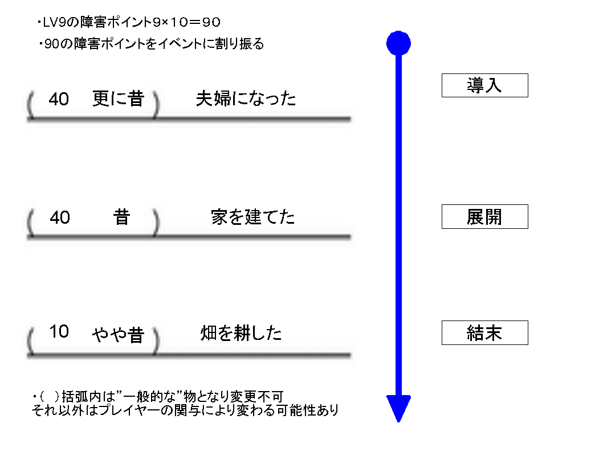
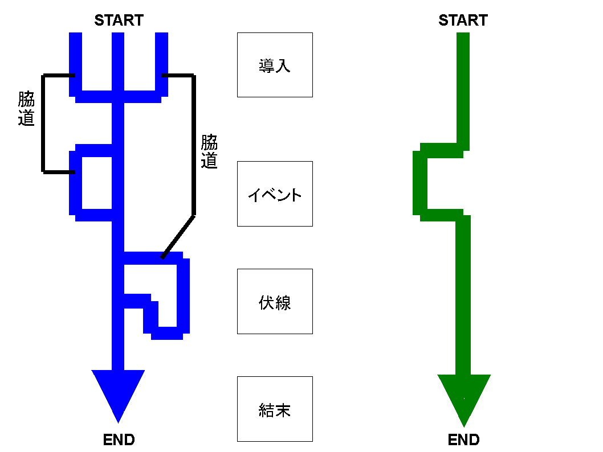

第八章　セッション運営

systemのセッション運営は自然です。

<a href="files/session1.pdf">「session1.pdf」をダウンロード</a>

<a href="https://github.com/op3kitt/kin_sys/blob/master/0101_EVENT_TABLE.md">一章</a>で 
分解したイベント表を 
このようにセッションごとに語りながら並べていくわけである。 
(つまり今までのTRPGセッションと同じようにである)

イベント表には障害ポイントを割り振る形になる。 
　障害は依頼であり、モンスターであり。壁であり、土砂崩れであり、地域特有の風習であり、その地方の気候だったりする。 
世界観に沿ってフェアにシナリオ作成できる。 
RPG熟練者が良くやっていたことであり理解も容易でしょう。

　これを、個々の<a href="0400_DESCRIPTION_SHEET.md">第四章</a>、描写シートにて乗り越えていくのです。 
それは、キャラ描写であり、実際の技能だったりする。

　よって管理が楽で、あらゆるシナリオパターンを再現出来る。

　そして変更されたシナリオは波のように上位の物語へ変化をもたらす。 
これがまた下位に影響を与えていく。 
ちょっとした事件解決が上位の物語を大きく揺るがすことも。 
（これは<a href="0100_CREATE_STORY.md">一章</a>の物語分解で明らか　分解された下位から上位に影響があるということ　逆もあり）

systemは以上が素早く、簡単に奥深く、はしょらず出来るのです。

<a href="files/session2.pdf">「session2.pdf」をダウンロード</a>

<strong>導入</strong>：ゲームマスターが用意（イベント表に記入）、または 
　　　　プレイヤーが作成（イベント表に記入）

<strong>イベント</strong>：使ったイベント表がイベント

<strong>伏線</strong>：使わなかったイベント表が伏線

<strong>脇道</strong>：イベント表を使わない行動

<strong>結末</strong>：ゲームマスターが用意（イベント表に記入）、または 
　　　　プレイヤーが（イベント表に記入）作成

　シナリオや実際のセッション進行はＴＲＰＧのゲーム的な醍醐味です。 
しかしながら、既存のシステムでは（偽りの分かりやすさである）インスタントアイディアの無味乾燥な物か 
奥が深いが不安定な運営しか出来ない（時代に合わない）のが常でした。

　systemはご覧のように豊かなセッション進行を真の意味で分かりやすく進めることが可能なのです。

