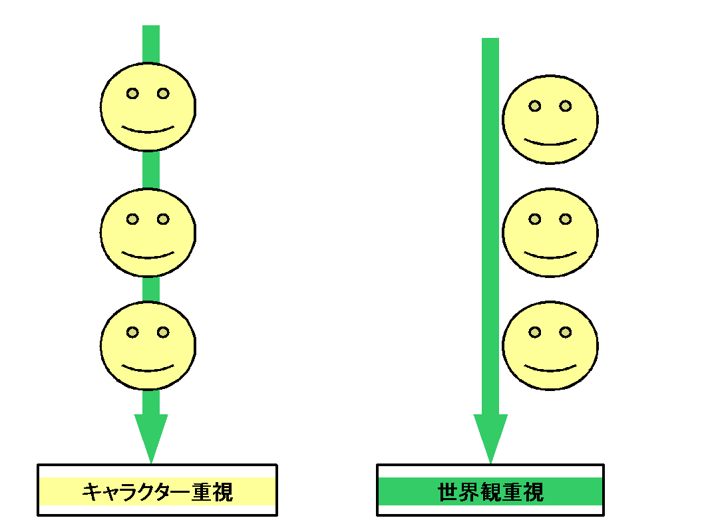

第九章　物語、システム、世界観、キャラクターの方向、配分

 
systemは物語重視またはシステム重視なのか、加えて世界観重視またはキャラクター重視なのか 
こんな問題も越えてしまいます。

 
<a href="0100_CREATE_STORY.md">第一章</a> 
「テーマ」と「テーマを固定するもの」にあるように 
世界観を形作っている物語は分解することで色々なカテゴリに分かれます。

 
キャラクターを世界観にどれだけ含めるのか決めることで 
世界観とキャラクターとの割合の大枠を決めます。

　・カテゴリを物語方向から注力するなら<a href="0700_ACTION_DETERMINATION.md">七章</a>、<a href="0800_SESSION_RUNNING.md">八章</a>のように行動ポイントのsystemを多めに採用すればよい。

　・カテゴリをシステム方向から注力するなら従来のシステムを多めに採用するべきだ（しかし従来のシステムが簡易な判定や戦闘のものが多いため、そういうものが多くなるだろう）。

大枠を決めた後でも細かく調整可能だ。

　・物語方向でも、前もってGMが出すカードの量を増やしたり減らしたりすることで 
物語的即興性、物語的作家性を調整可能であるし、 
　行動ポイントの変更によりsystem的に調整も可能である。

 
　・システム方向でも、従来どおり偶然性を上げたり下げることにより 
システム的即興性、システム的作家性を調整可能であるし、 
　システムの変更によりシステム的に調整も可能である。

 
<strong>共通調整方法</strong>（ただし前もって割合をプレイヤーに提示すること）

　　・世界観とキャラクターとの割合を決め大枠が決まります

分解前の物語（世界観）にプレイヤーキャラクターを含めなければ世界観重視の物語となります。

分解前の物語（世界観）にプレイヤーキャラクターを含めればキャラクター重視の横つながりが強い物語となります。

　

　<a href="files/important_cw.pdf">「important_cw.pdf」をダウンロード</a>

 
<strong>物語方向調整方法</strong>（ただし前もって割合をプレイヤーに提示すること）

　　・前もってGMが出すカードの割合提示（即興性重視なら10パーセント　作家性重視なら90パーセントなど） 
　　・行動ポイントの提示（世界の変更を大幅に許すなら行動ポイントを上げる）

<strong>システム方向調整方法</strong>（ただし前もって割合をプレイヤーに提示すること）

　　・従来通りのシステム調整

 
　 
　これにより、ＴＲＰＧで問題の多い謎解きシナリオも容易に運営できるでしょう。 
（美しい推理や解決、わくわくする即興性も破綻無く同時進行し再現可能） 

