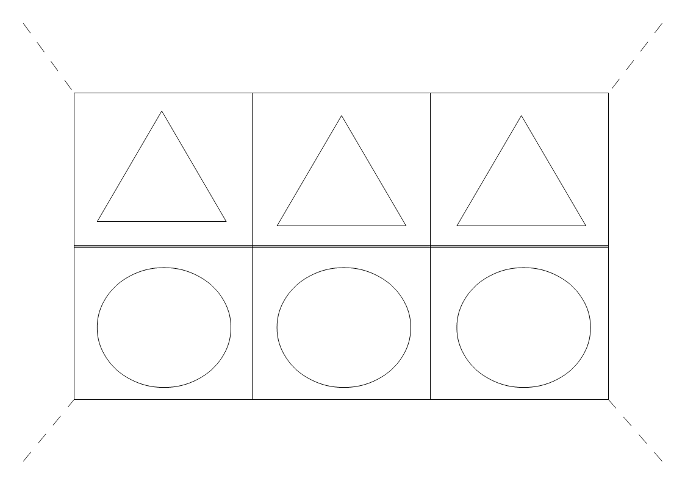
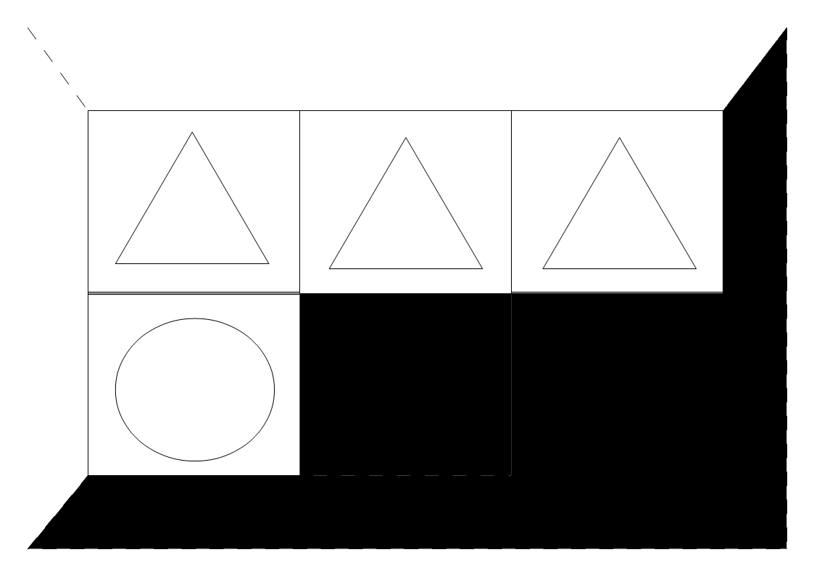
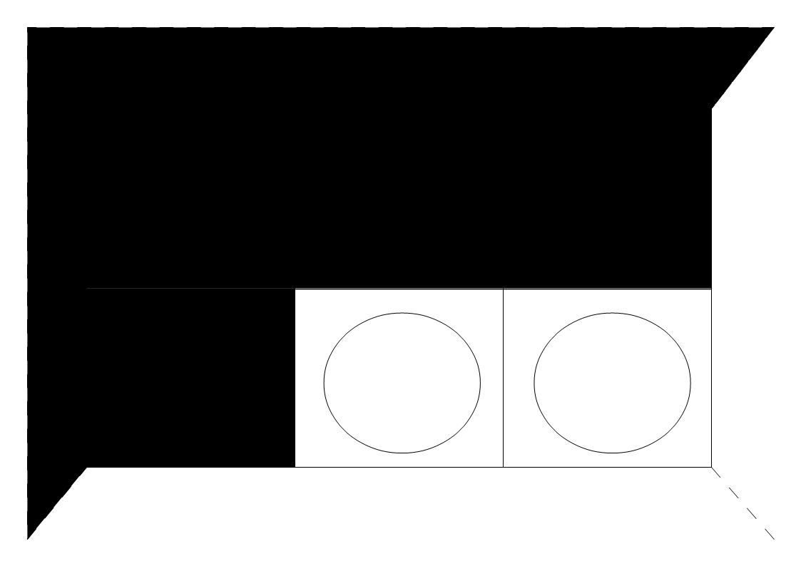
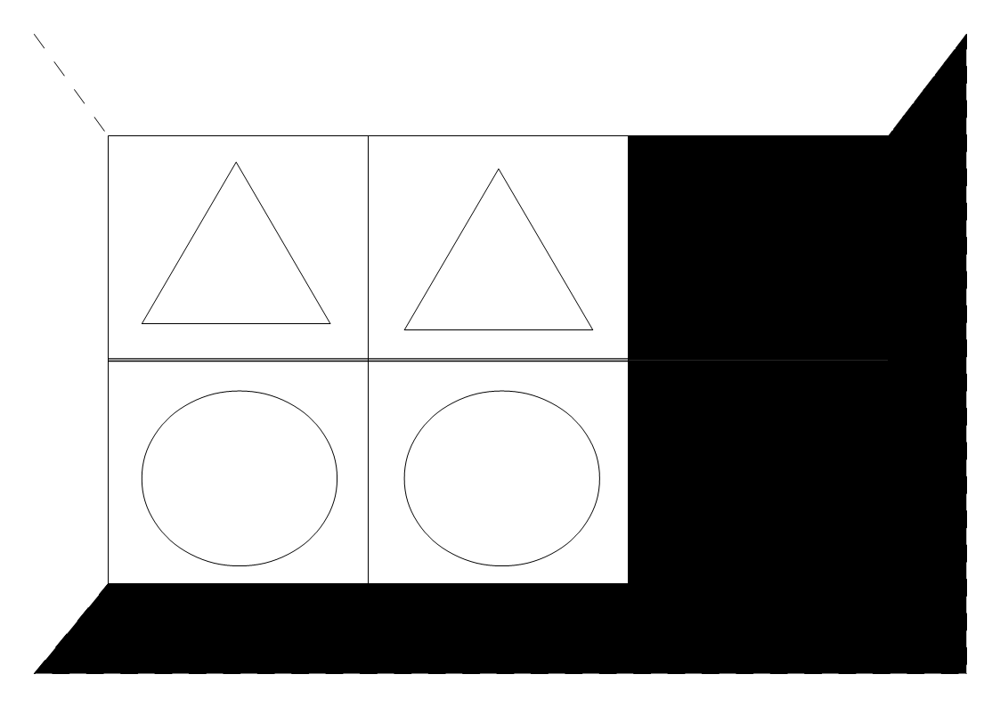
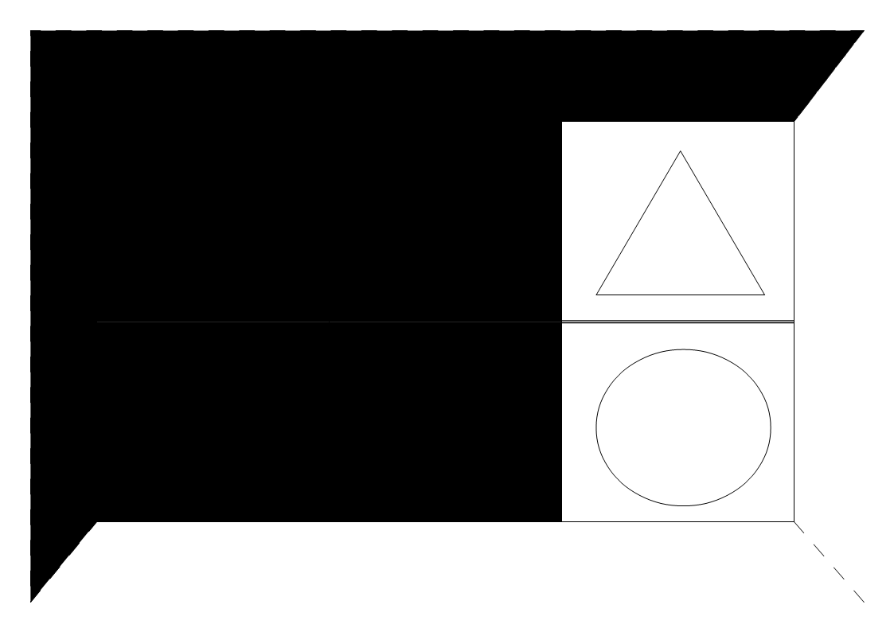
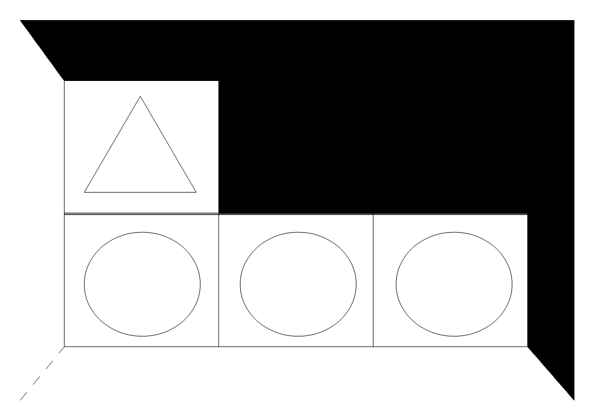
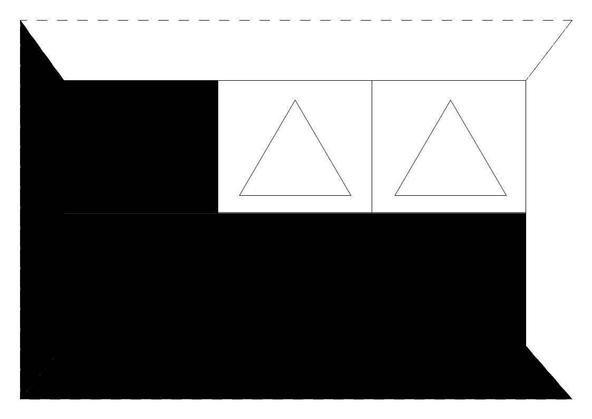

第十一章　ユーザーインターフェース

systemデザイナーは、場合によってはユーザーインターフェースを作成しても構いません。

これにより、system本来の安定度を台無しにせず、ユーザーグループに最適な調整と利便性向上が成し遂げられます。

また複数のユーザーインターフェースを好みにより選択することにより、より自分好みにカスタマイズ可能です。

例：keshyo

<strong>０．名前を付けましょう：</strong> 
systemの表面を覆うということで、化粧のkeshyoという名前にしてみました。

<strong>１．主にユーザーの利便性向上ということを目的として下さい：</strong>

今回は、より高速に、より容易にという要求に答える為のものとなります。

<strong>２．また本来systeｍでサポートしない機能を追加してもいいです：</strong>

加えて、ユーザー間の連携についても考慮するとします。

 
<strong>keshyo</strong>

 
<a href="files/keshyo.pdf">「keshyo.pdf」をダウンロード</a>

<strong>３．形を作っていきます：</strong> 
今回は紙を切って使うものとします。

<strong>４．利便性を作っていきます：</strong> 
他プレイヤーの描写の介入と防御を表していきます。 
回復も表します。

<strong>A：介入３と防御１と回復２</strong>（介入重視）

 
<a href="files/a-keshyo-cut31fd.pdf">「a-keshyo-cut31fd.pdf」をダウンロード</a>

 
<a href="files/a-keshyo-cut02re.pdf">「a-keshyo-cut02re.pdf」をダウンロード</a> 
--

<strong>B：介入２と防御２と回復２</strong>（バランス重視）

 
<a href="files/b-keshyo-cut22fd.pdf">「b-keshyo-cut22fd.pdf」をダウンロード</a>

 
<a href="files/b-keshyo-cut11re.pdf">「b-keshyo-cut11re.pdf」をダウンロード</a> 
--

<strong>C：介入１と防御３と回復２</strong>（防御重視）

 
<a href="files/c-keshyo-cut13fd.pdf">「c-keshyo-cut13fd.pdf」をダウンロード</a>

 

 
<a href="files/c-keshyo-cut20re.pdf">「c-keshyo-cut20re.pdf」をダウンロード</a>

<strong>５．行動ポイントとの連動を決めます：</strong>

 
A、B、C共に利用時13ポイント行動ポイント消費とします。

 
<strong>６．運用方法を決めます：</strong>

A、B、Cはセッション開始前に決めてセッション終了まで不変です。

介入、防御、回復にマーカー（目印）を置きます。 
それぞれのマスに一つづしか目印は置けません。 
使用した目印はマスから外します。

目印を移動したり、増やしたりできるのは 
自分のイベント表を使う手順のみです。

回復からは（イベント表を使う手順で） 
自由に介入、防御へ目印は移動可能です。

回復を使いきった後、介入、防御、回復の目印を増やしたいなら 
再度13ポイント消費する必要があります（自分の1イベント表につき一回のみです 
使わず消える目印もあるかもしれません）。

 
介入したい場合、介入の目印を消費、介入されたくない場合、相手は防御の目印を同数消費で防御。 
介入は相手防御以上、目印消費で介入可能となります。

<strong>・介入；</strong>介入されたPC（A）のプレイヤー（A）の代わりに、介入したプレイヤー（B）がPC（A）描写が可能です。 
<strong>・防御；</strong>介入されたPC（A）のプレイヤー（A）が介入したプレイヤー（B）のPC（A）描写を防ぎます。 
<strong>・回復；</strong>自由に介入、防御へ目印は移動可能

